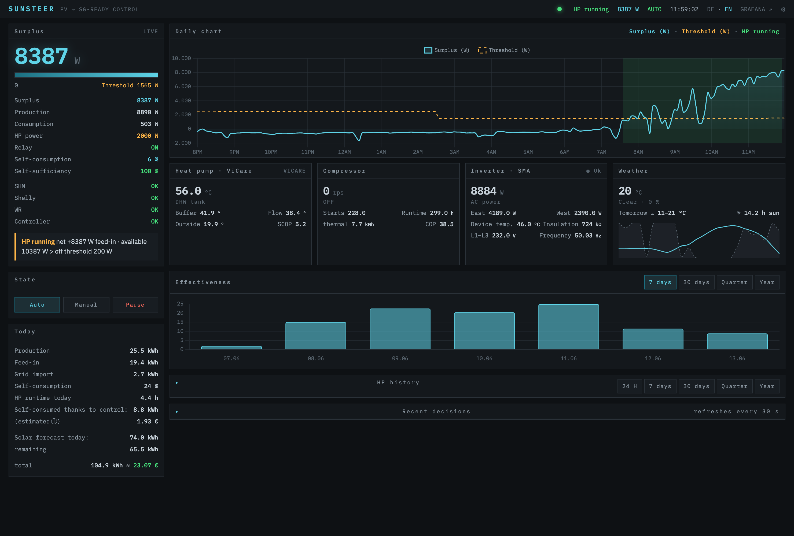
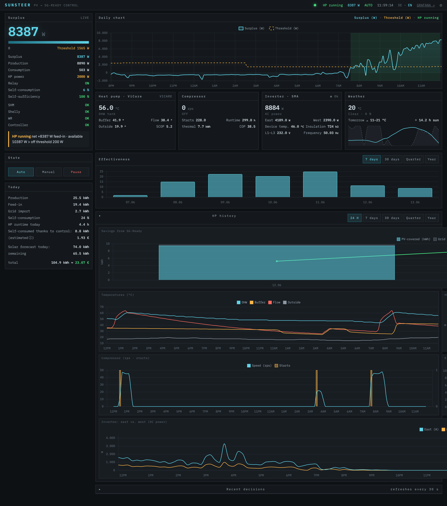
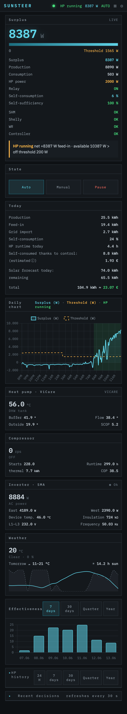
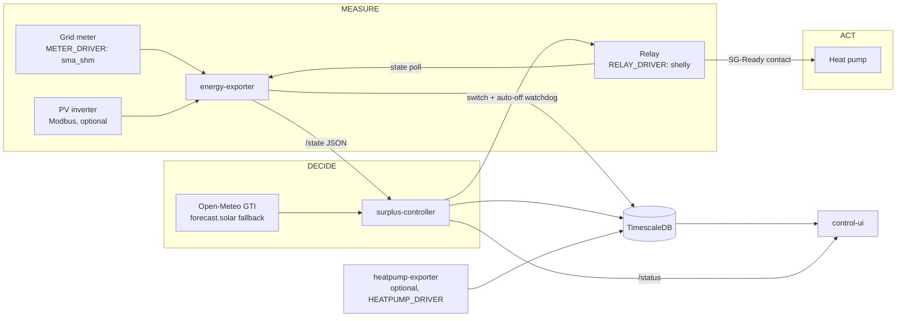

# Sunsteer

[](https://github.com/slippyex/sunsteer/actions/workflows/ci.yml)
[](https://github.com/slippyex/sunsteer/releases)
[](LICENSE)

**Local SG-Ready heat-pump control from PV surplus.**

Sunsteer reads your grid meter, decides when genuine PV surplus is available, and
switches your heat pump's SG-Ready input through a local relay — no cloud, fully
observable, with a web UI that explains every single decision.

It exists because the vendor cloud couldn't switch a relay. The full story:
[*The Relay the Cloud Couldn't Switch*](https://medium.com/@mvelten773/the-relay-the-cloud-couldnt-switch-c6eac9dab196).



<sub>The control room: live surplus and the decision being made right now (left), today's
surplus/threshold/heat-pump-run timeline, heat-pump · inverter · weather telemetry, and the
effectiveness of self-consumed PV. History and the full decision log expand below.</sub>

<details>
<summary>More views — history charts &amp; mobile</summary>

History expanded (savings, temperatures, runtime vs. surplus, compressor, efficiency, PV strings):



The same control room on a phone:



</details>

## Try it in two minutes — no hardware needed

```bash
git clone https://github.com/slippyex/sunsteer.git
cd sunsteer/deploy/compose
docker compose -f docker-compose.demo.yml up -d
```

Open **http://localhost:8080** (login `admin` / `sunsteer`). A synthetic PV "day"
passes every 10 minutes; switch the mode to **auto** in the settings to watch the
controller decide in real time. The heat-pump telemetry card is populated too — the demo
runs the `heatpump-exporter` with its `mock` driver (`HEATPUMP_DRIVER=mock`), so no vendor
account is needed. Tear down with `docker compose -f docker-compose.demo.yml down -v`.

## Features

- **Adaptive threshold** — the ON threshold scales with the remaining PV forecast for
  the day (Open-Meteo GTI per roof plane, forecast.solar fallback), so cloudy days
  still harvest surplus instead of waiting for a peak that never comes.
- **Self-calibrating** — the forecast's performance ratio is recalibrated daily from
  your actual production. No manual tuning drift.
- **Real PV headroom** — the controller acts on `production − base_load` (the surplus left
  after the rest of the house), learned live from your meter, instead of a fixed heat-pump
  estimate — so the pump isn't held on grid power when it modulates down. Falls back to a
  sun-gated estimate when no inverter is present.
- **Hysteresis done right** — ON/OFF streak requirements, minimum runtimes and
  off-times protect the compressor; no relay flapping on passing clouds.
- **Sun-aware** — the surplus calculation knows the sun's position; once it's down there is
  no PV to harvest, so the heat pump is released instead of being held ON on grid power.
- **Fail-safe by design** — stale meter data switches the heat pump OFF; a hardware
  auto-off watchdog on the relay catches a dead controller; the web UI is
  fail-closed behind HTTP Basic auth. See [docs/architecture.md](docs/architecture.md).
- **Explainable** — every decision lands in a decision log with its reason; the UI's
  "why" card explains in plain language (English/German) what the controller is
  waiting for right now.
- **Runtime tuning in the UI** — thresholds, delays, runtimes and prices live in the
  database and hot-reload every control cycle. Static hardware config stays in `.env`.
- **Observable** — Prometheus metrics from every service, optional Grafana add-on,
  English alert rules included.

## Run it for real

You need: a grid meter the exporter can read (currently **SMA Sunny Home Manager 2.0**),
a **Shelly Gen2 relay** (e.g. Pro 1PM) wired to the heat pump's SG-Ready input, and a
Linux host with Docker on the same network. Wiring belongs in the hands of a licensed
electrician — read [DISCLAIMER.md](DISCLAIMER.md) first.

```bash
cd deploy/compose
cp .env.example .env     # fill in the marked REQUIRED values
docker compose up -d     # pulls released images from GHCR
```

Step-by-step instructions: [docs/setup.md](docs/setup.md) ·
Supported devices and wiring notes: [docs/hardware.md](docs/hardware.md)

Kubernetes: see [deploy/k8s/](deploy/k8s/) for example manifests (a generic kustomize
base — the reference install runs on K3s).

Released images (multi-arch, `linux/amd64` + `linux/arm64` — Raspberry Pi works):

| Image | Purpose |
|---|---|
| `ghcr.io/slippyex/sunsteer/energy-exporter` | Meter readings (Speedwire multicast or mock), relay state, optional inverter telemetry; serves `/state` + `/metrics`; writes TimescaleDB |
| `ghcr.io/slippyex/sunsteer/surplus-controller` | The control loop: adaptive threshold → hysteresis → switch the relay; fail-safe OFF on stale data |
| `ghcr.io/slippyex/sunsteer/control-ui` | Web UI (EN/DE): live status, decision log with explanations, history charts, settings |
| `ghcr.io/slippyex/sunsteer/heatpump-exporter` | Optional: generic heat-pump telemetry (temperatures, compressor, energy counters); `HEATPUMP_DRIVER=vicare` for Viessmann ViCare, `mock` for the demo — see [docs/heatpump-interface.md](docs/heatpump-interface.md) |

## Architecture



Details, data flow and the fail-safe chain: [docs/architecture.md](docs/architecture.md)

## Different hardware?

The controller only consumes a small, versioned `/state` JSON — it does not care where
the numbers come from. Two ways to bring your own meter:

1. **In-tree driver:** implement the `GridMeter` protocol in
   `services/energy-exporter/src/drivers/` (the built-in `mock` driver is the template).
2. **Your own exporter:** serve the documented `/state` contract from any process —
   see [docs/state-interface.md](docs/state-interface.md).

The **relay** (`RELAY_DRIVER`) and **heat-pump telemetry** (`HEATPUMP_DRIVER`) are pluggable
the same way — see [docs/relay-interface.md](docs/relay-interface.md) and
[docs/heatpump-interface.md](docs/heatpump-interface.md).

Contributions welcome: [CONTRIBUTING.md](CONTRIBUTING.md)

## Roadmap

- More meter drivers (Shelly 3EM at the feed-in point, Tibber Pulse, P1/DSMR)
- Grafana dashboard provisioning
- More SG-Ready states than ON/OFF (e.g. recommendation vs. command)
- MQTT / Home Assistant integration

## License

[MIT](LICENSE) — see [DISCLAIMER.md](DISCLAIMER.md) before wiring anything to a
heating system. Sunsteer is a private project and is not affiliated with SMA,
Shelly/Allterco, or Viessmann.
