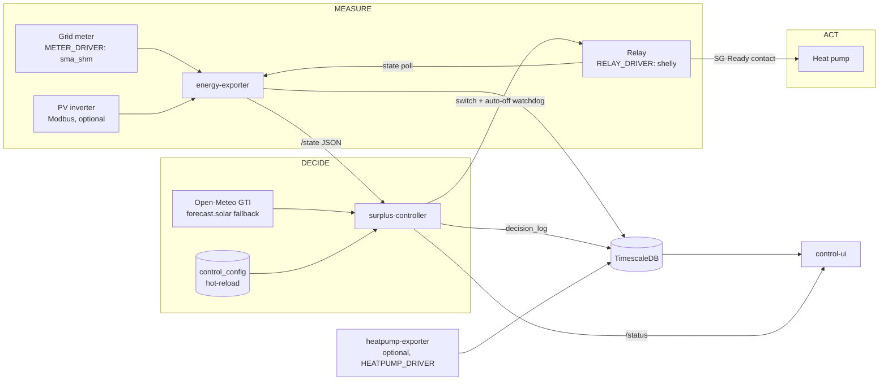

# Architecture

Four small services around one TimescaleDB. Each is independently testable, speaks to
the others only via documented interfaces (HTTP JSON, SQL, Prometheus), and ships as
its own container image.

## Components

### energy-exporter — measure

Reads the grid meter through a selectable driver (`METER_DRIVER`): `sma_shm` joins the
SMA Speedwire multicast group (`239.12.255.254:9522`, hence `network_mode: host`) and
decodes the Home Manager's telegrams; `mock` generates a synthetic day curve for
demos. It also polls the Shelly relay state and, optionally, an SMA inverter via
Modbus TCP (per-string DC power, temperature, lifetime yield). Outputs: the versioned
[`/state` JSON](state-interface.md) for the controller, Prometheus `/metrics`, and
time-series rows flushed to TimescaleDB every 60 s. Strictly read-only — this service
never switches anything.

### surplus-controller — decide and act

A deliberately boring loop (default every 15 s):

1. **Read** `/state` and the hot-reloaded `control_config` from the DB.
2. **Compensate own load:** `available = surplus + (relay_on ? wp_nominal_power : 0)`.
   Once the heat pump runs, it consumes the very surplus that justified switching it
   on — without this, the controller would oscillate. **Sun-aware:** the compensation is
   only applied while the sun is above `PV_SUN_MIN_ELEVATION_DEG` (default 3°). After dark
   no PV is possible, so the `+ wp_nominal` term would be a phantom surplus that keeps the
   pump running on grid power; below the elevation the raw (negative) surplus is used and the
   off-hysteresis releases the pump.
3. **Adaptive threshold:** `threshold = base − (base − min) × remaining_kwh / full_sun_ref_kwh`,
   with the forecast factor clamped to `[0, 1]`. While plenty of PV is still ahead,
   the threshold sits low — switching on early is safe because the day will sustain
   the run. As the remaining forecast shrinks (late in the day, overcast), the
   threshold rises toward its base value: committing the pump's minimum runtime then
   requires strong, real surplus right now. `remaining_kwh` comes from Open-Meteo GTI
   per roof plane (forecast.solar as fallback), converted with a **performance ratio
   that self-calibrates daily** against your actual production.

   > Unlike the meter and relay (which sit behind `METER_DRIVER` / `RELAY_DRIVER` driver
   > protocols), the forecast is **deliberately not a pluggable driver**: it is a fixed
   > Open-Meteo-GTI-primary / forecast.solar-fallback strategy. Open-Meteo is global and
   > free, and the daily PR self-calibration absorbs source bias, so a provider abstraction
   > would add a seam with no second implementation to justify it (YAGNI) — the
   > self-calibration, not source-swapping, is what makes the controller robust to a
   > mediocre forecast.
4. **Hysteresis state machine:** the threshold must be exceeded for `on_delay_cycles`
   consecutive cycles to switch ON (and the OFF condition for `off_delay_cycles` to
   switch OFF); `min_runtime_s` / `min_offtime_s` protect the compressor. Modes:
   `auto`, `manual`, `paused`.
5. **Act + audit:** switch the Shelly (every ON command re-arms its hardware auto-off
   watchdog) and write the decision with its reason to `decision_log`.

### control-ui — explain

FastAPI + htmx + Chart.js, bilingual (EN/DE), fail-closed behind HTTP Basic auth. The
"why" card translates the controller's current state into a sentence ("OFF — 465 W
below the 2382 W threshold, 2/3 cycles"), the decision log shows every switch with its
reason, history charts cover temperatures, runs, compressor, savings. Runtime tuning
(thresholds, delays, prices) is edited here and takes effect the next control cycle —
no restarts. It reads the controller's live decision state from the versioned
[`/status` contract](status-interface.md).

### heatpump-exporter — optional telemetry

Polls a selectable driver (`HEATPUMP_DRIVER`) for heat-pump internals (temperatures, compressor
speed/starts, energy counters) and writes them to the `heatpump_telemetry` TimescaleDB table.
Informative only — the control loop never depends on it. The built-in drivers are `vicare`
(Viessmann ViCare cloud API — mind its [data quirks](hardware.md#heat-pump-telemetry-vicare-driver))
and `mock` (synthetic telemetry for the demo). See [docs/heatpump-interface.md](heatpump-interface.md)
for the full contract and "bring your own driver" instructions.

## The fail-safe chain

Layered so that each failure mode has a catcher, and every layer fails towards
"surplus mode off, heat pump runs normally":

| Failure | Catcher |
|---|---|
| Meter stops reporting (multicast lost, exporter down) | `shm_age_s` grows → controller switches OFF after a short grace period (`state_stale_failsafe`) |
| Controller dies mid-run | Shelly's **hardware auto-off watchdog** (`SHELLY_AUTOOFF_SECONDS`) fires because nothing re-arms it |
| Relay unreachable (WiFi drop) | Same watchdog; plus `shelly_reachable` metric + alert rule |
| Someone/something else switches the relay | The controller detects the external change, reconciles its state and logs `external_change` |
| Misconfigured UI deployment | UI without `ADMIN_PASS` serves 503 — never an open control panel |

What the system deliberately does **not** do: bypass the heat pump's own protections.
SG-Ready is an input to the pump's controller, not a motor switch.

## Data model (TimescaleDB)

| Table | Writer | Content |
|---|---|---|
| `energy_meter` | energy-exporter | 60-s aggregates: import/export/surplus, per-phase W, lifetime counters, optional inverter fields |
| `heatpump` | energy-exporter | Relay state + power per poll (~1 min cadence) |
| `decision_log` | surplus-controller | Every decision: mode, surplus, threshold, action, reason, audit fields |
| `control_config` | control-ui (writes), controller (reads each cycle) | Runtime tuning key/values |
| `heatpump_telemetry` | heatpump-exporter | Optional heat-pump telemetry (driver-agnostic; see [heatpump-interface.md](heatpump-interface.md)) |

Fresh installs get the full schema from `db/init.sql`; upgrades apply numbered,
idempotent scripts from `db/migrations/` (the compose stack does this automatically on
start).
